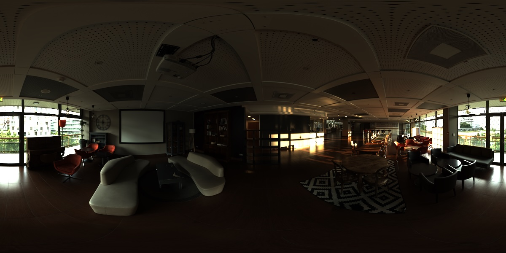
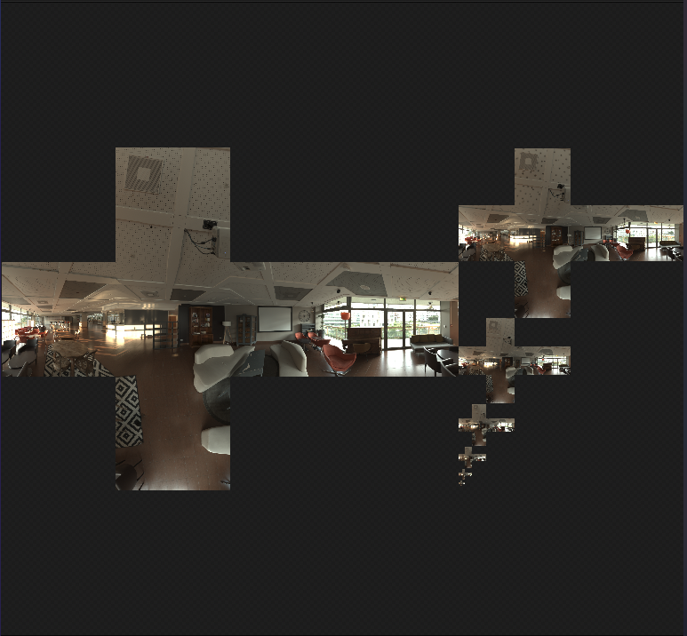
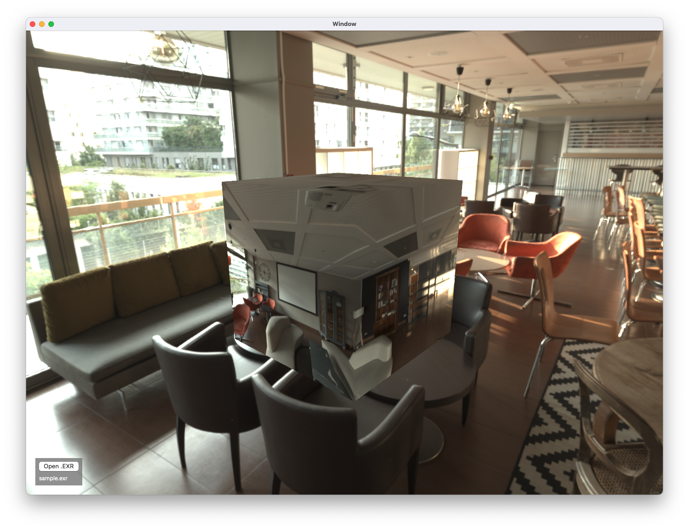

# OpenEXRConnection
EXRファイルから360度画像(Equirectangular形式の画像)を読み込むためのSwiftパッケージです。

## Features
- Equirectangular形式のEXRファイルからCubemapのMTLTextureを生成できます

## Install
### Framework
準備中...

## Usage
```swift
import OpenEXRConnection

func load(url: URL) async throws {
    let device = MTLCreateSystemDefaultDevice()!
    let texture = try await generateCubeTexture(device: device, from: url)

    // CubemapのTextureを使用できます
    // ...
}
```

## Preview
| Equirectangular EXR | Cubemap Texture | Preview |
| --- | --- | --- |
|  |  |  |

## Sample Project
OpenEXRConnectionSample プロジェクトを使用して、OpenEXRConnectionの使用方法を確認できます。

### Prepare
1. リポジトリをクローンする 
1. CMakeをインストール
1. `make` を実行して、OpenEXRの静的ライブラリを作成する
1. `OpenEXRConnection.xcodeproj` を開く
1. `OpenEXRConnectionSample` スキーマを選択してビルドする

## Build
手元でビルドする場合も、Sample ProjectのPrepareと同様の手順を実行してください。
